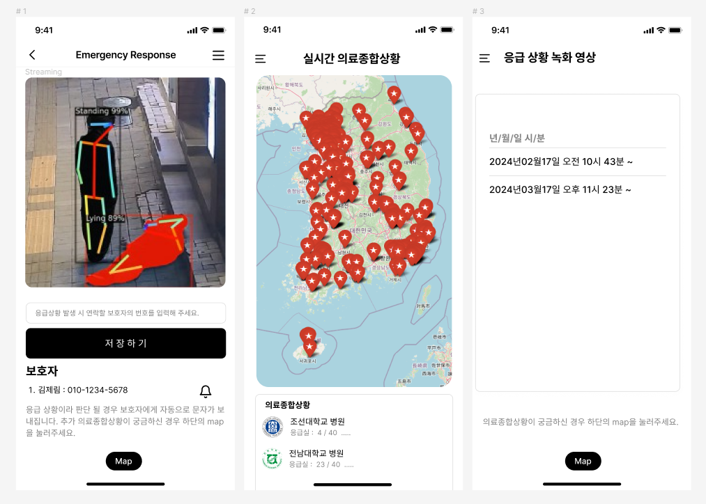

# Emergency Response Project


# Team Emergency Response

### 팀원 및 역할
이름 | 역할 | GitHub
---|-----|---
김제림 | 개발 | [jerry-1211](https://github.com/jerry-1211)
박세현 | 개발 | [pseheon](iamsh2012@naver.com)
김소정 | 개발 | [SoJung21](00Kimsojung00@gmail.com )

# 주제 및 기대효과

- ## 선정 동기
  한국 의료 시스템 위기 직면과 응급실 방문자 수 급증에 따른 주제선정

<!-- - ## 게임 장르
  - 1대1 대전형 멀티플레이 캐주얼 게임
  
  - 멀티플레이 / PC 게임 / 패키지 게임 -->

- ## 내용
  응급 상황을 감지 및 녹화하는 카메라와 사용자에게 최적의 의료종합상황 시각화 및 통계를 제공하는 서비스 
  
- ## 기대효과
  2023년 10월 정부가 통과시킨 의대생 증원 법안으로 한국 의료 시스템은 심각한 위기에 직면해 있다. 또한 최근 증가하는 고령화 사회와 만성 질환 환자의 증가로 응급실 방문자 수가 급증하고 있지만, 환자들이 적절한 치료를 받기까지는 오랜 시간을 기다려야한다. Emergency Response 서비스는 응급환자에게 정리된 양질의 데이터를 제공하고, 의사에게는 환자의 응급상황 녹화본을 제공하여, 보다 정확한 진단을 내릴 수 있도록 해준다. 따라서 이러한 서비스는 환자와 의사 모두에게 수요가 높을 것으로 기대가 된다.


# 프로젝트 구상도

<!-- {: width="10%" height="10%"} -->


<!-- # 디렉토리 구조
```sh
├─Docs
│  ├─Proposal  
│  ├─Technical_Document
│  ├─WBS
│  ├─Weekly_Report
├─Project
│  ├─RuleMate_Project
│  ├─readme.md
```


# Architecture


# 기획 문서
### [Proposal](https://github.com/hhj3258/RuleMate_Project/tree/main/Docs/Proposal)
- 그래픽 아트 기획서
- 리소스 기획서
- 시스템 기획서
- 컨셉 기획서

# 개발 환경
- Engine : 유니티(Unity) - Ver.2020.3.5f1
- language : C#

# Assets
- Quick Outline
- Simple Happy Casual Game Music
- 게임 플레이 캐주얼 사운드
- Low poly Garbage Pack
- low poly interior 4
- GUI PRO Kit - Simple Casual

# Plugins
- DOTween
- Photon PUN2
- Log Viewer -->

# Commit Rules
type | 설명
---- | ----
[feat] | 새로운 기능에 대한 커밋
[fix] | 버그 수정에 대한 커밋
[build] | 빌드 관련 파일 수정에 대한 커밋
[chore] | 그 외 자잘한 수정에 대한 커밋
[ci] | CI관련 설정 수정에 대한 커밋
[docs] | 문서 수정에 대한 커밋
[style] | 코드 스타일 혹은 포맷 등에 관한 커밋
[refactor] |  코드 리팩토링에 대한 커밋
[test] | 테스트 코드 수정에 대한 커밋
[project] | 프로젝트 변경 사항에 대한 커밋
